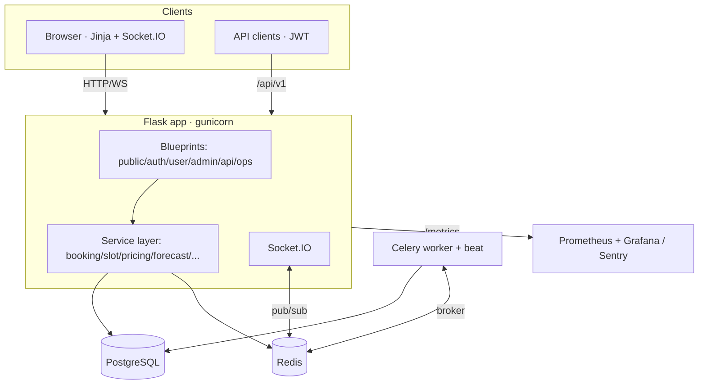
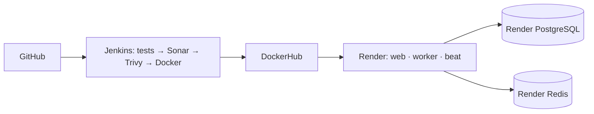

# SmartPark ITS — System Design

## 1. Overview

SmartPark is a real-time smart-parking platform. Drivers discover live slot
availability, reserve/book with a strict no-double-booking guarantee, pay
demand-based pricing, and receive QR receipts. Admins manage lots and view
real-time analytics. The system is observable, tested, and horizontally
scalable.

## 2. Component diagram



## 3. Booking request lifecycle (the critical path)

```mermaid
sequenceDiagram
  participant U as User
  participant API as Flask
  participant DB as PostgreSQL
  U->>API: POST /book (slot_id, vehicle)
  API->>DB: BEGIN; SELECT slot FOR UPDATE
  Note over API,DB: row lock serializes concurrent bookers
  API->>DB: INSERT booking(status=active); UPDATE slot=occupied
  alt unique index violated (lost the race)
    DB-->>API: IntegrityError
    API-->>U: 409 "slot just taken"
  else success
    DB-->>API: COMMIT
    API->>API: reprice() + broadcast_slots() (WS)
    API-->>U: 201 booking
  end
```

## 4. Data model

```mermaid
erDiagram
  USERS ||--o{ BOOKINGS : makes
  PARKING_SLOTS ||--o{ BOOKINGS : holds
  USERS { int id PK; string email UK; enum role; int failed_logins; datetime locked_until }
  PARKING_SLOTS { int id PK; string slot_number UK; enum status; enum vehicle_type; float base_rate; float surge_multiplier }
  BOOKINGS { int id PK; int user_id FK; int slot_id FK; enum status; datetime start_time; float total_cost }
```

Key invariant — enforced in the database, not just code:
```sql
CREATE UNIQUE INDEX uq_active_booking_per_slot ON bookings (slot_id) WHERE status='active';
CREATE UNIQUE INDEX uq_active_booking_per_user ON bookings (user_id) WHERE status='active';
```

## 5. Deployment



Provisioned via [`render.yaml`](../render.yaml) (web + Postgres + Redis). Local
parity via [`docker-compose.yml`](../docker-compose.yml) (app, worker, beat, db,
redis, prometheus, grafana).

## 6. Scaling plan (what changes at 1000×)

| Concern | Today | At scale |
|---------|-------|----------|
| Web tier | 1 gunicorn (gthread) | N replicas behind LB; Redis-backed Socket.IO so WS fan-out works across replicas |
| DB writes | single Postgres | connection pooling (PgBouncer); read replicas for analytics; partition `bookings` by month |
| Hot reads | Redis cache (15s TTL) on availability | shorter TTL + WS push as source of truth; cache stampede protection |
| Booking contention | row lock + partial unique index | unchanged correctness; shard by lot to spread lock contention |
| Background work | Celery worker + beat | autoscale workers per queue depth |
| Pricing/forecast | synchronous + periodic | move to stream processing on a bookings event log |
| Observability | Prometheus + Grafana + Sentry | add OpenTelemetry tracing across web→worker |

## 7. Trade-offs

See the [Architecture Decision Records](adr/). Highlights: pessimistic locking
over optimistic for booking (low retry complexity, contention is per-slot and
low), WebSockets over SSE/polling (bidirectional + mature client), Postgres over
SQLite (concurrent writers + real geospatial/indexing).
